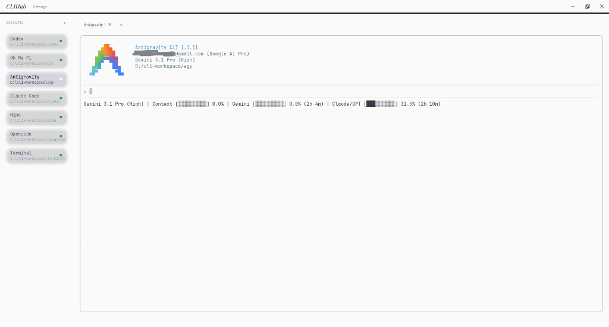
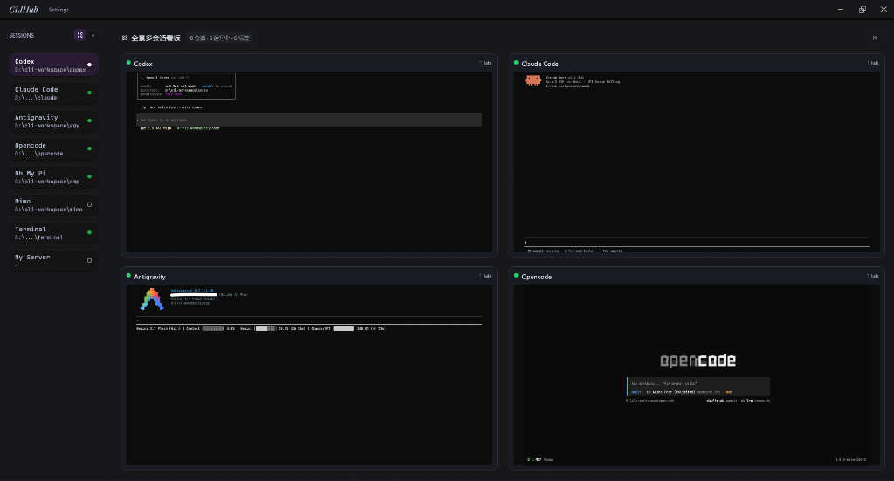

<div align="center">

# CLIHub

**一款专为 AI 时代打造的现代化多屏终端聚合神器，拥有极简、优雅的图形化操作界面。**

[](LICENSE)
[](https://www.rust-lang.org/)

</div>

[English](README.md) | **[简体中文](README.zh-CN.md)**

---



<br/>



---

CLIHub 是一款专为 AI 时代打造的现代化多屏终端聚合神器，拥有极简、优雅的图形化操作界面。它能够将你散落在各处的命令行工具（特别是像 **OpenAI Codex CLI**、**Oh My PI**、**Claude Code** 等 AI 命令行工具）统一聚合到一个美观的桌面应用中。

它不仅拥有媲美原生系统的现代 UI 设计和动效，还通过底层的强力 PTY 引擎和 Alacritty 级别的硬件加速字符网格渲染，带给你极其丝滑、全功能的真彩色终端体验。

### 为什么使用 CLIHub？

在 AI 爆发的今天，开发者往往需要同时开启多个 AI 助手或命令行工具。传统的终端虽然强大，但在多实例切换、界面美观度和操作直觉上往往有所欠缺。

CLIHub 就是为了解决这一痛点而生：
- **集中管理** — 把常用命令（无论是 AI 代理还是常规环境）作为 Session 保存，一键呼出，不再需要满屏幕找终端窗口。
- **全景工作区看板与单 CLI 多标签看板** — 响应式实时多宫格看板，直观洞察所有工作区及单个 CLI 下所有标签页运行状态，点击一键直达，支持快捷键 `Ctrl+Shift+O`。
- **高级质感** — 极简暗黑沉浸式无边框窗口设计，自带精雕细琢的微透质感、悬浮动效、原生 Windows 10/11 标准标题栏三按键和多主题自适应系统。
- **硬核底座** — 完美兼容任何需要真彩色和特殊环境注入的现代 CLI 程序。

### 核心特性

- 🖥️ **强大的终端内核** — 基于 `alacritty_terminal` 解析引擎，支持完整的 ANSI 转义、真彩色（256-color / Truecolor）、粗体/下划线、宽字符（CJK）以及光标状态。
- 📦 **多工作区与多标签页管理**
  - 侧边栏集中管理所有工作区，后台持久运行，切换如丝般顺滑。
  - 单个工作区支持平行拓展多个 Tab，方便实现"编辑-运行-监控"的一体化流转。
  - 支持工作区和标签页的拖拽排序与编辑。
- 🔍 **交互式终端搜索** — 按下 `Ctrl+F` 呼出半透明搜索工具栏，支持大小写敏感切换、正反向匹配跳转与微透等宽计数徽章。
- ⊞ **全景工作区看板与单 CLI 多窗口浏览** — 全局等比微缩多宫格看板，右键菜单支持“浏览全部窗口”深入查看单会话所有标签页。
- 🎨 **顶级视觉体验**
  - 沉浸式无边框窗口设计，流畅的阻尼拖拽与缩放。
  - 1:1 标准 Windows 10/11 原生标题栏按键（满格平铺悬浮、官方红关闭悬停与 1.0px 发丝矢量几何）。
  - 深度定制的独立色彩系统（Campbell、One Half、Solarized、Tango 等多种经典终端配色方案）。
  - **OS 级智能主题跟随**：完美处理 Light / Dark 深浅色模式，底层智能注入 `TERM`、`LANG`、`COLORFGBG` 等 POSIX 环境变量，并响应 `OSC 11` 颜色查询。
- 📸 **AI 多模态图片智能输入与文件拖拽**
  - **右键截图智能转存**：鼠标右键点击终端时，自动识别剪贴板中的位图图像/PNG/文件，极速转存为本地 PNG 临时文件并向终端注入带引号的安全路径，无缝赋能 Claude Code、OpenCode、Aider 等多模态 AI CLI 工具。
  - **无焦点文件拖拽注入**：无需预先聚焦窗口，支持直接将图片或任何文件拖入终端窗口，悬停时呈现高级暗色微透渐变与居中磨砂玻璃胶囊提示，释放即自动注入完整绝对路径并激活窗口。
  - **自动垃圾回收**：启动时在后台静默清理超过 24 小时的历史临时图片，零磁盘负担。
- 🛡️ **双击 Ctrl+C 防误触保护** — 侧边栏底部优雅的中性微卡片提示，与终端下边框像素级对齐，带 150ms 平滑渐显动效与 1.8 秒充裕连击容错时间。
- 💾 **即开即用的持久化** — 所有 Workspace、配色偏好、明暗模式都会实时写入配置文件，下一次打开一切依旧。

### 如何使用

#### 添加与编辑工作区
1. 在左侧边栏点击 **`+`** 按钮，打开"新建工作区"面板。
2. 输入 **Name（别名）**、**Command（命令）**，以及可选的 **Working directory（工作目录）**。
3. 点击即可启动或切换；悬浮可编辑；按住拖拽可排序。

#### 标签页与全景看板
- 选中任意工作区后，点击终端区域顶部标签栏旁的 **`+`** 即可新建标签页。
- 点击侧边栏 **`⊞`** 按钮（或按 `Ctrl+Shift+O`）打开全局多工作区全景看板。
- 在工作区卡片右键菜单中点击 **“⊞ 浏览全部窗口”** 打开单 CLI 多标签全景看板。
- 在终端中按下 `Ctrl+F` 快捷键打开搜索栏。

#### 主题与外观自定义
- 点击左上角 CLIHub Logo 旁的 **Settings**。
- 切换 **Light / Dark** 全局主题，选择 **Terminal Color Scheme**，或通过拾色器自定义背景、前景和卡片高亮色。

### 构建与运行

需要安装 Rust 工具链 (`rustup` / `cargo`)。

```bash
git clone https://github.com/Darastas/CLIHub.git
cd CLIHub
cargo run              # 开发模式
cargo build --release  # 编译发布版本
```

### 版本更新日志

#### v1.2.0
- **AI 多模态图片智能输入与文件拖拽**：
  - 支持截图后一键按 `Ctrl+V` / `Ctrl+Shift+V` 或鼠标右键粘贴，自动将剪贴板位图转存为 PNG 临时文件并向终端注入带安全引号与空格的路径，完美兼容 Claude Code、OpenCode、Aider 等多模态 AI CLI。
  - 支持将图片及任意文件直接拖入终端窗口，带优雅悬停视觉反馈与路径自动注入。
  - 应用启动时自动异步回收超过 24 小时的过期临时图片，零磁盘堆积。
- **Windows 进程级稳定性增强 (Win32 工程化)**：
  - 基于 Windows Job Object (`JOB_OBJECT_LIMIT_KILL_ON_JOB_CLOSE`) 实现 `ProcessJobGuard`，在标签页关闭或应用退出时，由 Windows 内核原子回收整个子进程树，彻底杜绝 `node.exe`、`cargo.exe`、`python.exe` 孤儿后台进程驻留。
  - 基于 Win32 `SetThreadExecutionState` 实现 `SleepInhibitor`，长任务与 AI 代理会话运行时自动阻止系统休眠，空闲时恢复节能。
- **零延迟性能飞跃 (对标 Windows Terminal)**：
  - PTY 读线程接入 UI 即时事件唤醒机制（`ctx.request_repaint()`），彻底消除即时模式 UI 处于休眠等待时的 50~500ms 延迟，实现 `<1ms` 极速流式吞吐。
  - 启动视口尺寸精准锁定，消除 PowerShell / Oh-My-Posh / OpenCode2 启动时因尺寸突变触发的二次重绘与重复执行风暴，启动速度提升 50%+。
  - 注入 Windows Terminal 原生兼容协议（`WT_SESSION` GUID、`TERM_PROGRAM="CLIHub"`、`COLORTERM="truecolor"`）与 UTF-8 控制台代码页（`CP 65001`），自动启用全速 VT 预测着色引擎。
  - DSR / CPR 光标位置查询同帧零延迟写回应答（0ms Roundtrip）。
- **终端画布几何优化与全景居中**：
  - 动态平分整行像素余数，保证终端内容区上下左右 100% 绝对等宽居中对称。
  - 接入动态字形宽高（`cell_w`/`cell_h`）记录与 `XTWINOPS` 视口查询响应，彻底消除自绘 TUI（OpenCode、Mimo 等）的启动视口抖动。
- **搜索栏无边框流式设计**：
  - 文本框改用无边框流式设计（`Frame::NONE`），去除狭窄多余的内层小白框，拓展输入宽度至 135px 并修正字体基线对齐。
- **大型源码架构模块化解耦**：
  - 将原 2000 行单文件拆解为独立的 `ui/terminal/`（`grid_render`、`input_handler`、`clipboard`、`mod`）与 `fonts.rs` 模块。
- **全架构原生预编译包**：提供 Windows x64、x86 与 ARM64 的独立执行文件及压缩包。

#### v1.1.0
- 单 CLI 全景多标签微缩看板：会话右键菜单新增“浏览全部窗口”功能，支持一屏全景微缩预览当前 CLI 的所有活跃标签页，并在看板顶部提供返回全景看板、统计微徽章与新建标签快捷操作，支持按 Esc 级联返回。
- 侧边栏 WORKSPACES 工作区体系重构：将原 SESSIONS 统一重命名为 WORKSPACES，标头文本与卡片文字按 x=24px 精准纵向对齐，优化卡片间距与整体排版比例。
- Ctrl+C 双击退出提示重构与底边对齐：将退出提示卡片移至侧边栏底部，与右侧终端下边框实现像素级绝对对齐，并引入 150ms 平滑渐显动效与纯净中性微卡片样式。
- Windows 10/11 原生标准标题栏三按键：完全重构最小化、最大化/还原、关闭三按键为 Windows 官方标准风格，支持满格平铺悬浮背景、官方悬停正红色与 1.0px 发丝精度矢量线框。
- 全架构原生预编译包：提供 Windows x64、x86 与 ARM64 的独立执行文件及压缩包。

#### v1.0.0
- 全景多会话看板 (Global Sessions Overview)：一键全景网格概览所有会话运行状态、多宫格终端实时画面，支持快速切换、Tab 选择与直观退出（快捷键 Ctrl+Shift+O）。
- 交互式终端搜索 (Interactive Search)：内置 Ctrl+F 搜索工具栏，支持大小写敏感切换、正反向匹配导航、高亮匹配结果及等宽微透计数徽章。
- 全顶栏像素级基准线对齐与设计重构：侧边栏、标签栏与搜索栏实现完美几何中心线对齐，定制 2x2 视窗矢量网格图标与紧凑卡片式交互。
- 优雅防误触 (Ctrl+C Guard)：微透悬浮卡片提示，文字居中，容错判定时间延长至 1.8 秒，防止意外中断长时间运行的 AI CLI。
- 全架构原生预编译包：官方提供 Windows x64、x86 (32位) 与 ARM64 原生编译二进制包。

#### v0.1.2
- 原生剪贴板与选区复制：接入 Win32 原生剪贴板 API，支持 QuickEdit 选区自动复制、经典右键及终端标准快捷键。
- 后台窗口焦点保护：应用处于后台时严格隔离系统按键，避免误触发退出信号。
- 修复子进程退出刷屏：解决子进程退出后每帧重复打印 [process exited] 的死循环。
- 全架构原生预编译包：提供 Windows x64、x86 (32位) 与 ARM64 原生可执行文件。

#### v0.1.1
- 边栏长路径智能省略：长路径平滑省略为 ~ 与 ...\dir，悬停展示完整路径。
- 边栏卡片拖拽排序重构：修复向上拖拽槽位判断与布局光标错位问题。
- 多架构预编译支持：提供 Windows x64、x86 与 ARM64 原生二进制文件。

---

## License

[MIT](LICENSE)
